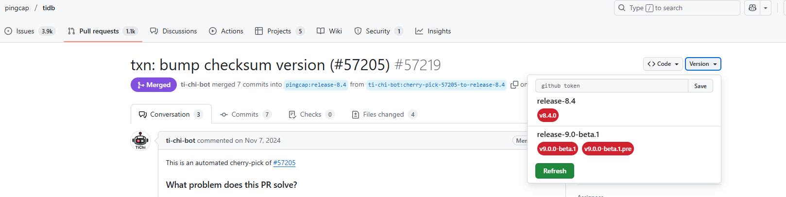

# TiDB Release Version

A userscript for GitHub to query tidb release version, built using only the GitHub REST API. Check out [@octokit/rest.js](https://github.com/octokit/rest.js) for more details.

## Usage

1. Install [Tampermonkey](https://www.tampermonkey.net/index.php).
2. Add the userscript [tidb-release-version.user.js](https://github.com/wk989898/tidb-release-version/raw/master/tidb-release-version.user.js) to Tampermonkey.
3. [Disable Content Security Policy (CSP)](https://github.com/lisonge/vite-plugin-monkey/issues/1)
4. Configure a `GITHUB_TOKEN` to bypass REST API [rate limits](https://docs.github.com/en/rest/using-the-rest-api/rate-limits-for-the-rest-api).
